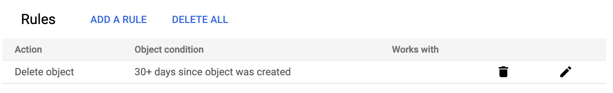

# Introduction

TTL, or Time to Live, is a fundamental concept in cloud computing, defining data's validity period. 
Google Cloud Storage (GCS), Google's object storage service, offers the foundation for efficient data storage and retrieval. 
Terraform, an Infrastructure as Code (IaC) tool, streamlines the creation and management of cloud infrastructure, making it an invaluable asset in the GCS context. 
In this blog post, we'll explore how TTL can be harnessed in GCS using Terraform to enhance data management.


I don't assume any responsibility for data deletion mistakes. Deleting data is permanent and cannot be undone. Ensure you fully comprehend the implications of applying data expiration rules in your GCS buckets. This blog offers guidance on TTL configuration, but it's your responsibility to ensure it matches your data retention policies and needs.


# Creating bucket with lifecycle rules

## Simple bucket

Creating a GCS bucket with a basic expiration rule is relatively straightforward. 
You can define a simple policy to delete objects older than a specified number of days. 
Here's an example of Terraform code to create such a bucket:

```hcl
resource "google_storage_bucket" "my_bucket" {
  name          = "kukulam-gcs-simple-bucket"
  location      = "US"

  lifecycle_rule {
    condition {
      age  = 30
    }
    action {
      type = "Delete"
    }
  }
}
```

This Terraform code creates a GCS bucket named "kukulam-gcs-simple-bucket" in the US region and defines a lifecycle rule to delete objects older than 30 days.









## Bucket with versioning

If you enable versioning on your GCS bucket, it allows you to retain multiple versions of the same object. 
When setting up TTL for such buckets, each version will have its own retention period. 
Here's an example of Terraform code for a versioned bucket:

```hcl
resource "google_storage_bucket" "my_versioned_bucket" {
  name          = "kukulam-gcs-versioned-bucket"
  location      = "US"
  versioning {
    enabled = true
  }

  lifecycle_rule {
    condition {
      age  = 30
      days_since_noncurrent_time = 7
    }
    action {
      type = "Delete"
    }
  }
}
```

This code creates a GCS bucket with versioning enabled and a lifecycle rule to delete objects older than 30 days. Additionally, it includes a condition to delete noncurrent versions after 7 days.









## Bucket with object locking

Object locking ensures that objects cannot be deleted or modified until their retention period expires. 
Below is an example of Terraform code for such a bucket:

```hcl
resource "google_storage_bucket" "my_locked_bucket" {
  name          = "kukulam-gcs-locked-bucket"
  location      = "US"

  retention_policy {
    is_locked = true
    retention_period = 7776000 # 90 days
  }

  lifecycle_rule {
    condition {
      age = 30
    }
    action {
      type = "Delete"
    }
  }
}
```

This code creates a GCS bucket with object locking enabled, providing a robust solution for data retention and compliance. It's important to note that, in this example, the deletion rule is set to 30 days. However, due to object locking with a retention period of 90 days, objects within this bucket will be locked and protected against deletion or modification for the full 90-day period. Therefore, while the deletion rule is specified as 30 days, the effective retention period is extended to 90 days due to the object locking configuration. This ensures a secure and compliant data retention strategy for your GCS bucket.











There is no option to enable object locking and versioning at the same time.



# Summary

In this blog post, we've explored how to set up TTL for GCS buckets using Terraform. 
We've covered creating simple buckets with basic expiration rules, versioned buckets, and buckets with object locking. 
Remember that TTL and data retention policies should align with your specific use case and compliance requirements. 
Always exercise caution when configuring deletion rules, as data once deleted may be irrecoverable. 
It's crucial to have a clear understanding of your data lifecycle management strategy when working with cloud storage services like Google Cloud Storage.

# References
- GCS Terraform [documentation](https://registry.terraform.io/providers/hashicorp/google/latest/docs/resources/storage_bucket)
- GCS [documentation](https://cloud.google.com/storage/docs)
- Terraform plans by [Terraform Cloud](https://app.terraform.io)
- Photo by [Aron Visuals](https://unsplash.com/@aronvisuals?utm_source=unsplash&utm_medium=referral&utm_content=creditCopyText") on [Unsplash](https://unsplash.com/photos/BXOXnQ26B7o?utm_source=unsplash&utm_medium=referral&utm_content=creditCopyText")