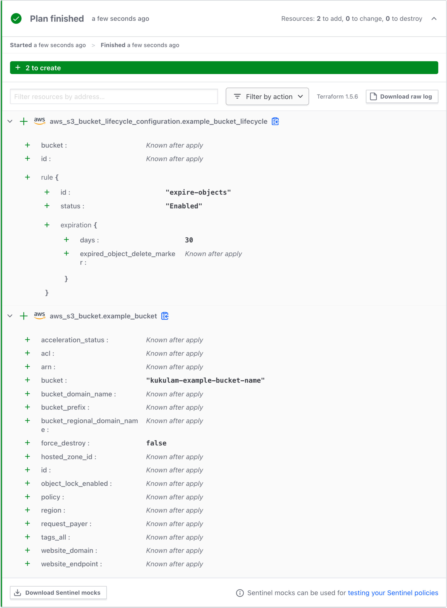
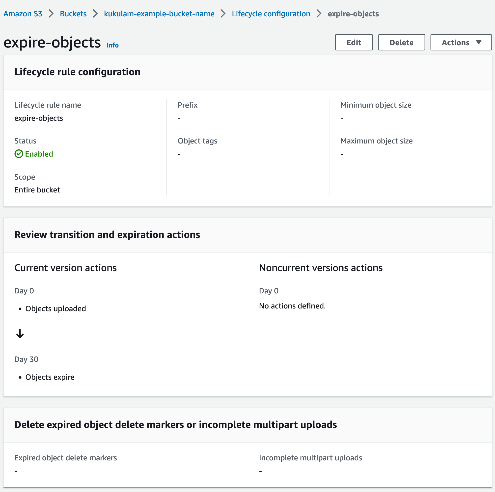
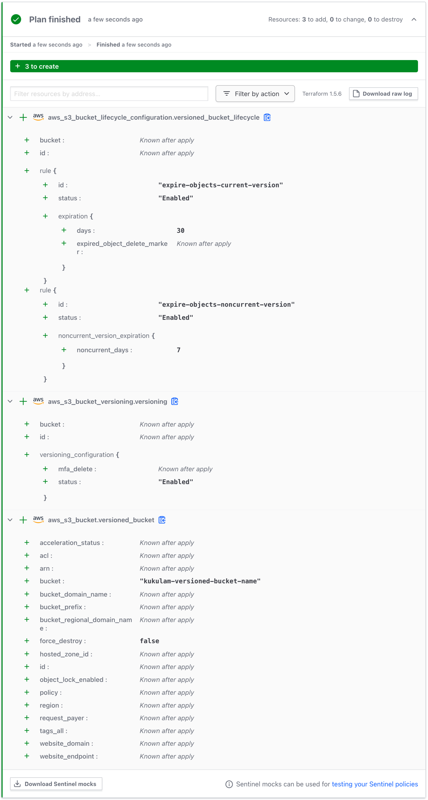
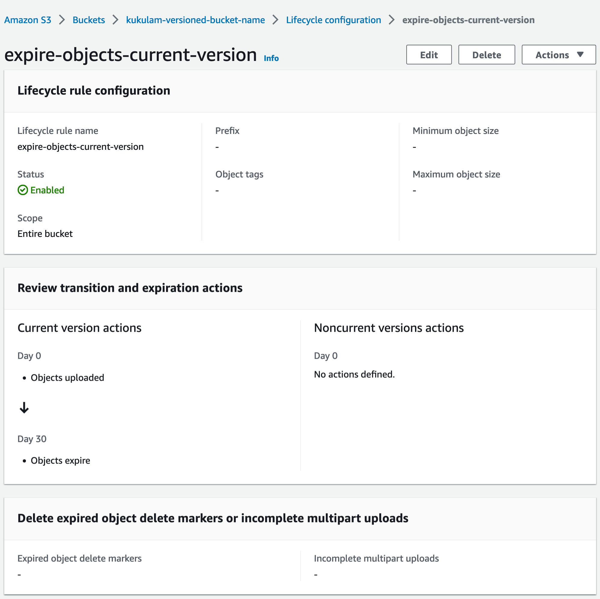
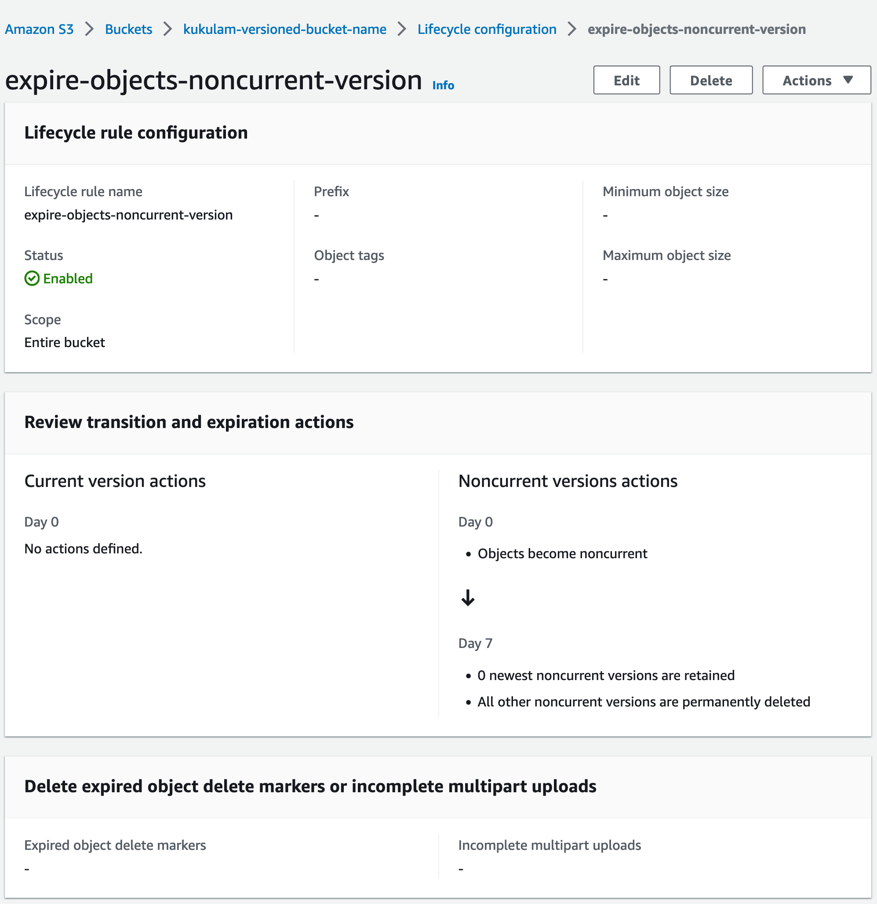
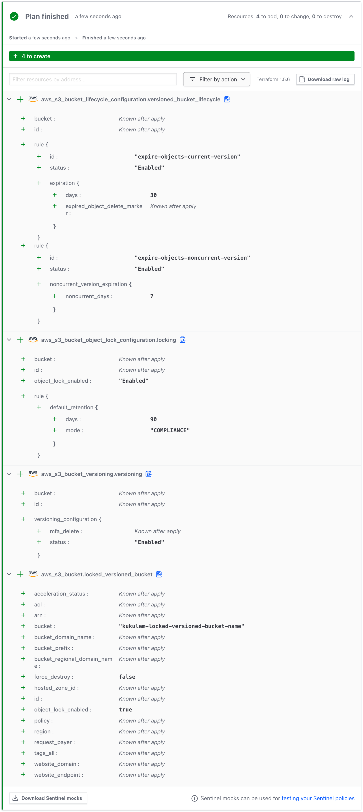
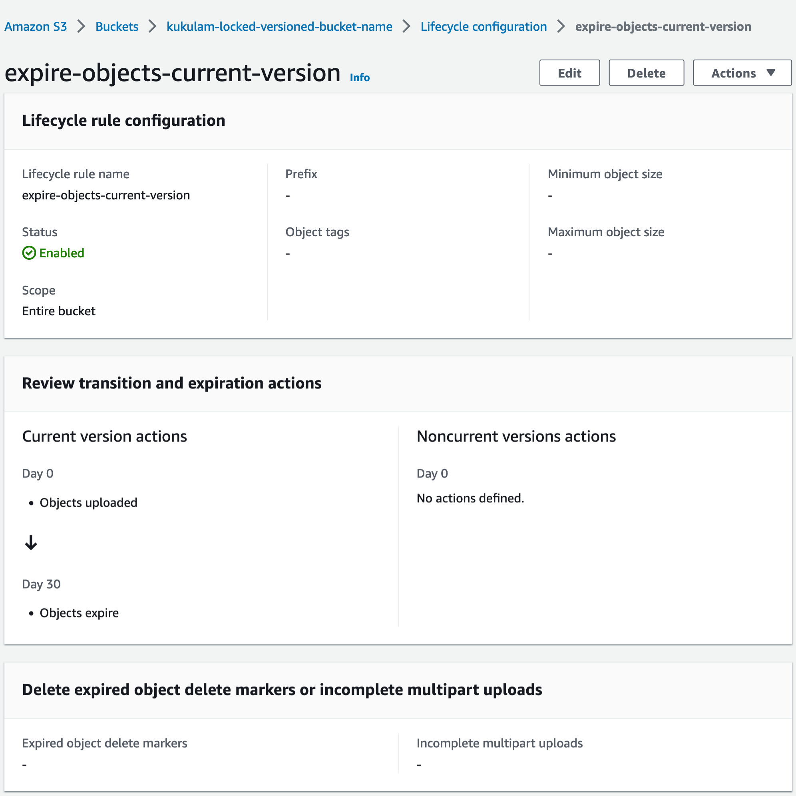
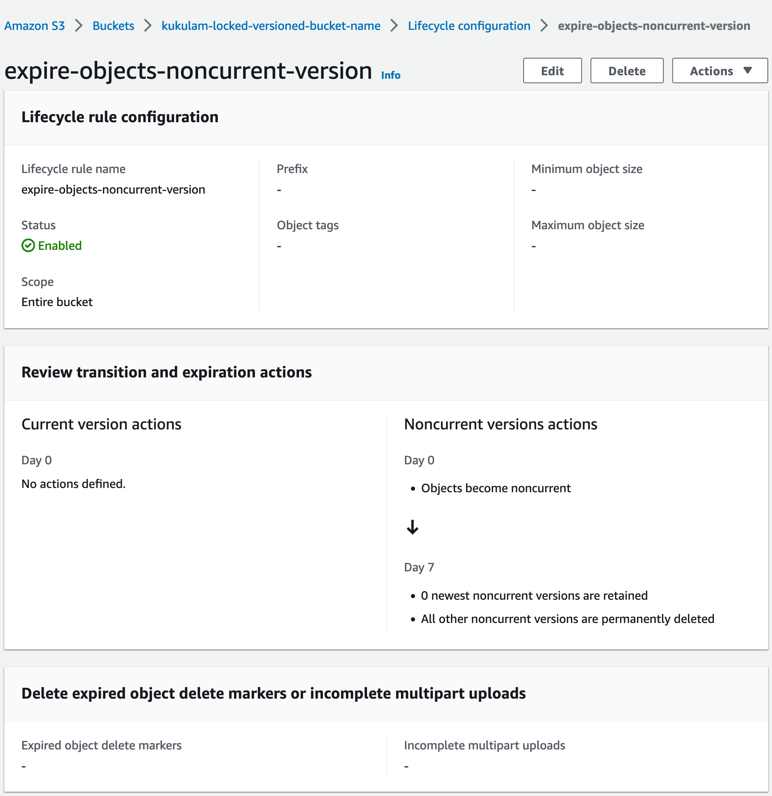
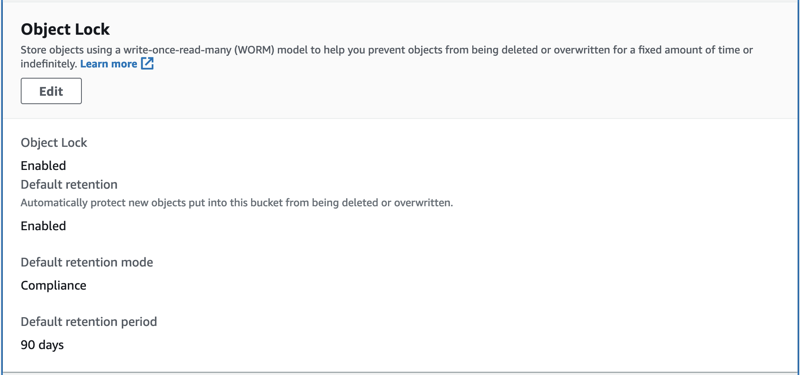

# Introduction
In the world of cloud computing, managing data lifecycle is a crucial aspect of optimizing storage costs and ensuring data security. 
"TTL" stands for "Time to Live," and it plays a vital role in defining how long data should be retained before it's automatically deleted or archived.

Amazon S3 (Simple Storage Service) is a popular cloud storage service by Amazon Web Services that allows you to store and manage vast amounts of data. 
Terraform, on the other hand, is an infrastructure as code tool that enables you to define and provision AWS resources with ease.

In this blog post, we'll explore how to set up TTL (or data expiration) for objects in an AWS S3 bucket using Terraform.


I don't assume any responsibility for data deletion mistakes. Deleting data is permanent and cannot be undone. Ensure you fully comprehend the implications of applying data expiration rules in your S3 buckets. This blog offers guidance on TTL configuration, but it's your responsibility to ensure it matches your data retention policies and needs.


# Creating bucket with lifecycle rules
Amazon S3 allows you to define lifecycle rules to manage objects automatically based on criteria such as age or transitions to different storage classes. Here, we'll look at three scenarios for setting up TTL in S3 buckets using Terraform.

## Simple bucket
In this scenario, we'll create an S3 bucket with a straightforward expiration rule that deletes objects after a specified number of days. Below is an example of Terraform code to achieve this:

```hcl
resource "aws_s3_bucket" "example_bucket" {
  bucket = "kukulam-example-bucket-name"
}

resource "aws_s3_bucket_lifecycle_configuration" "example_bucket_lifecycle" {
  bucket = aws_s3_bucket.example_bucket.id
  
  rule {
    id      = "expire-objects"
    status  = "Enabled"
    
    expiration {
      days = 30
    }
  }
}
```
In this example, objects in the "example-bucket-name" S3 bucket will be deleted automatically after 30 days.









## Bucket with versioning
When versioning is enabled for an S3 bucket, multiple versions of an object can exist over time. To set up TTL for such a bucket, you can configure the expiration rule for non-current versions as follows:
```hcl
resource "aws_s3_bucket" "versioned_bucket" {
  bucket = "kukulam-versioned-bucket-name"
}

resource "aws_s3_bucket_versioning" "versioning" {
  bucket = aws_s3_bucket.versioned_bucket.id

  versioning_configuration {
    status = "Enabled"
  }
}

resource "aws_s3_bucket_lifecycle_configuration" "versioned_bucket_lifecycle" {
  depends_on = [aws_s3_bucket_versioning.versioning]

  bucket = aws_s3_bucket.versioned_bucket.id

  rule {
    id      = "expire-objects-current-version"
    status  = "Enabled"

    expiration {
      days = 30
    }
  }

  rule {
    id      = "expire-objects-noncurrent-version"
    status  = "Enabled"

    noncurrent_version_expiration {
      noncurrent_days = 7
    }
  }
}
```
In this case, the current version will undergo expiration 30 days after its creation, while the non-current version will expire 7 days after transitioning into a non-current status.











## Bucket with versioning and object locking
If you want to ensure objects cannot be deleted before their TTL expires, you can enable object locking in your S3 bucket. Here's an example of Terraform code for a bucket with both versioning and object locking:
```hcl
resource "aws_s3_bucket" "locked_versioned_bucket" {
  bucket = "kukulam-locked-versioned-bucket-name"

  object_lock_enabled = true
}

resource "aws_s3_bucket_object_lock_configuration" "locking" {
  bucket = aws_s3_bucket.locked_versioned_bucket.id

  rule {
    default_retention {
      mode = "COMPLIANCE"
      days = 90
    }
  }
}

resource "aws_s3_bucket_versioning" "versioning" {
  bucket = aws_s3_bucket.locked_versioned_bucket.id

  versioning_configuration {
    status = "Enabled"
  }
}

resource "aws_s3_bucket_lifecycle_configuration" "versioned_bucket_lifecycle" {
  depends_on = [aws_s3_bucket_versioning.versioning]

  bucket = aws_s3_bucket.locked_versioned_bucket.id

  rule {
    id      = "expire-objects-current-version"
    status  = "Enabled"

    expiration {
      days = 30
    }
  }

  rule {
    id      = "expire-objects-noncurrent-version"
    status  = "Enabled"

    noncurrent_version_expiration {
      noncurrent_days = 7
    }
  }
}
```
In this example, objects are protected from deletion until their specified retention period has passed, and then they will be subject to the TTL-based expiration rule.













# Summary
Configuring TTL (Time to Live) for objects in your AWS S3 buckets is a valuable practice for efficient data management. With Terraform, you can easily define and provision S3 buckets with expiration rules to meet your data retention requirements. Be cautious when implementing these rules, as data deletion is irreversible, and it's crucial to align TTL settings with your organization's data policies and compliance needs. Properly managing the lifecycle of your S3 objects can help you save on storage costs and ensure that your data remains secure and compliant.

# References
- AWS S3 Terraform [documentation](https://registry.terraform.io/providers/hashicorp/aws/latest/docs/resources/s3_bucket.html)
- AWS S3 [documentation](https://docs.aws.amazon.com/s3/)
- Terraform plans by [Terraform Cloud](https://app.terraform.io)
- Photo by [Towfiqu barbhuiya](https://unsplash.com/@towfiqu999999?utm_source=unsplash&utm_medium=referral&utm_content=creditCopyText") on [Unsplash](https://unsplash.com/photos/Cv1IZqKJQzU?utm_source=unsplash&utm_medium=referral&utm_content=creditCopyText")