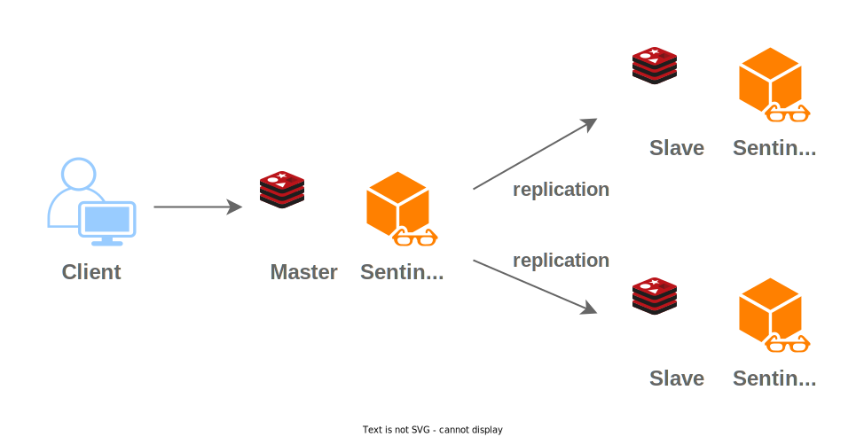
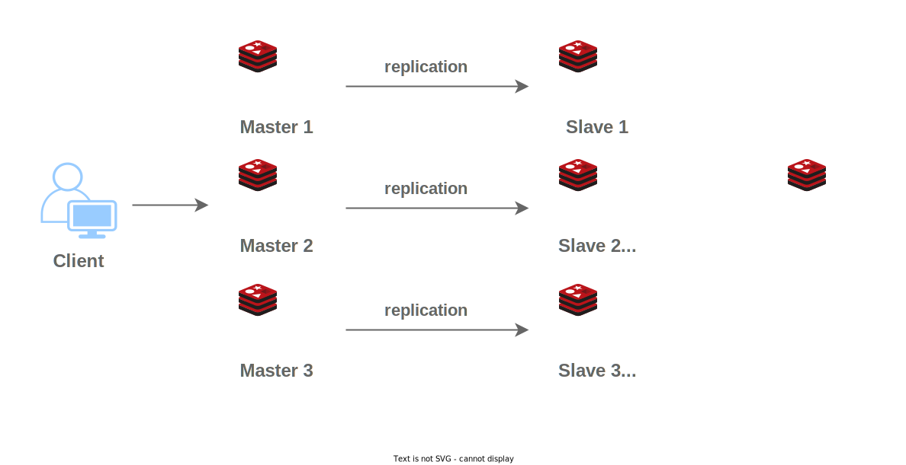
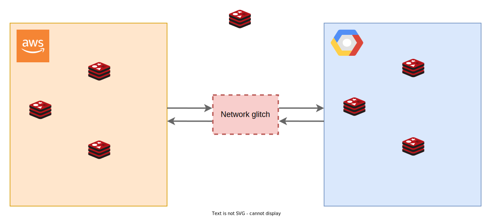

# Introduction
Deploying a Redis database on multiple cloud providers may seem like a logical choice to ensure high availability and survive potential disasters. 
However, before diving into this approach, it's important to carefully consider the node topologies and weigh the benefits against the complexities involved. 
In this blog post, we will delve into the reasons why deploying Redis on multiple clouds may not be worth the effort, focusing on node topologies that can maximize data availability.


If you are already familiar with the advantages and disadvantages of a multi-cloud environment, as well as the different versions of Redis, feel free to skip the paragraphs discussing the multi-cloud environment and types of Redis. 
You can proceed directly to the section _[Topology](#topology)_.


# Multi cloud environment
In the following paragraphs, we will discuss the advantages and disadvantages of a multi-cloud environment, exploring the benefits it brings as well as the challenges it presents.

## Surviving region disasters
One of the primary motivations for deploying Redis on multiple clouds is to mitigate the impact of a disaster occurring in a specific cluster or region. 
By spreading the database across different cloud providers, the intention is to ensure that the data remains available even if one provider experiences an outage or failure.

## High availability for data
Ensuring high availability for data, especially in the case of databases, is crucial for businesses that rely on real-time data access. 
By deploying Redis on two or more cloud providers, the aim is to maintain data availability even in the event of infrastructure issues or disruptions.

## The complexity of multi-cloud deployments
While the idea of multi-cloud deployments may sound promising, the practical implementation can be complex and challenging. 
Coordinating and synchronizing data across multiple clouds requires careful planning, robust infrastructure, and thorough monitoring. 
Ensuring data consistency and minimizing latency can become significant hurdles.

## Data synchronization and latency
When deploying Redis on multiple clouds, data synchronization becomes a critical concern. 
Ensuring that data is replicated and consistent across different clusters in real-time is a non-trivial task. 
Additionally, inter-cloud communication can introduce additional latency, affecting the overall performance and responsiveness of the system.

## Cost and operational overhead
Deploying Redis on multiple cloud providers incurs additional costs and operational overhead. 
Each cloud provider has its own pricing structure, and managing and monitoring resources across multiple platforms can be complex and time-consuming. 
It's essential to consider whether the benefits of redundancy outweigh the increased expenses and management complexities.

# Types of Redis
In the realm of Redis, there exist two distinct versions: the open-source version and the enterprise edition. 

For the purpose of this blog post, **our attention will be directed towards the open-source variant**. 
This version presents users with two different modes: Sentinel and Cluster.

## Redis Sentinel




### Overview 
Redis Sentinel is a critical component of Redis, offering high availability and automatic failover for Redis instances. 
It actively monitors the Redis infrastructure, ensuring the well-being of both Redis masters and slaves. 
Sentinel provides automatic notifications to administrators, keeping them informed about any changes in the Redis infrastructure. 
It operates as a separate process or component that seamlessly runs alongside Redis instances. 
In this mode, Redis functions in a master-slave configuration, enabling robust and reliable data management.

### Pros
- automatic failure detection and recovery
- high availability
- works with most clients and plugins

### Cons
- limited scalability
- setup is complex due to additional sentinel processes

## Redis Cluster




### Overview
Redis Cluster enables horizontal scaling of Redis by distributing data across multiple nodes using automatic sharding. 
It ensures high availability through automatic failover. 
Sharding in Redis Cluster partitions data into hash slots, assigning each slot to a node. 
Nodes are responsible for specific slots, and data is stored accordingly. 
When a client requests data, Redis uses consistent hashing to determine the node holding the data based on the key's hash value.

### Pros
- horizontal scalability
- high availability with automatic failover
- automatic resharding

### Cons
- configuration complexity
- limited support for clients and plugins
- comparing to Redis Sentinel, it has much fewer option for node selection during failover

# Topology

Let's imagine that we want to deploy Redis on 2 or 3 cloud providers to ensure that Redis will be working during cloud outage.
When we are using multiple clouds we need to be worry about splitbrain between clouds. 
Splitbrain is a sitation when one cloud lost connection to another cloud and both clouds lives indepemdent at the same time.





## Redis Sentinel

# Conclusion 

# References
- Redis architecture described in detail by [architecutrenotes](https://architecturenotes.co/redis)
- Diagrams by [draw.io](https://draw.io)
- Photo by [J Lee](https://unsplash.com/@babybluecat?utm_source=unsplash&utm_medium=referral&utm_content=creditCopyText") on [Unsplash](https://unsplash.com/photos/YTV-GHH9VpQ?utm_source=unsplash&utm_medium=referral&utm_content=creditCopyText")
  